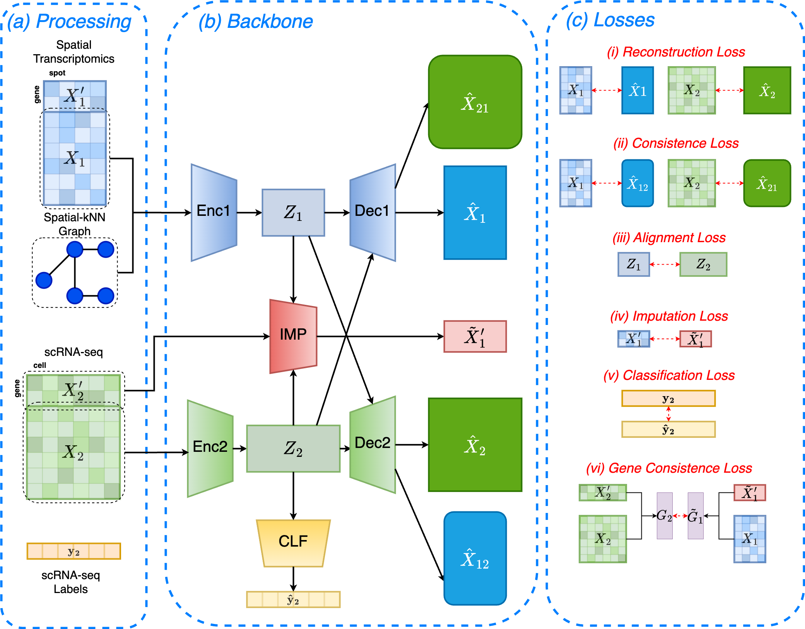

# stAI

## Overview
stAI (spatial transcriptomics Annotation and Imputation) is a method that can perform both cell type annotation and missing genes imputation for single-cell spatial transcriptomics (scST) data using scRNA-seq data as reference. It is a deep learning-based model to jointly embed two datasets and perform the downstream annotation and imputation tasks. 



## Prerequisites
It is recommended to use a Python version  `3.8`.
* set up conda environment for stAI:
```
conda create -n stAI python==3.8
```
* install stAI from shell:
```
conda activate stAI
```

* To build the required environment: 
```bash
conda env create -f environment.yml
```

stAI is test on GPU, the versions of [torch, torchvision](https://pytorch.org/) need to be compatible with the version of CUDA.


## Installation
You can install stAI via:
```
git clone https://github.com/gszou99/stAI.git
cd stAI
```

## Tutorials
The following are detailed tutorials. All tutotials were ran on gpu.

1. [Missing genes imputation for osmFISH dataset](./demo/impute_osmFISH.ipynb).
2. [Cell types annotation for osmFISH dataset](./demo/annotate_osmFISH.ipynb)
